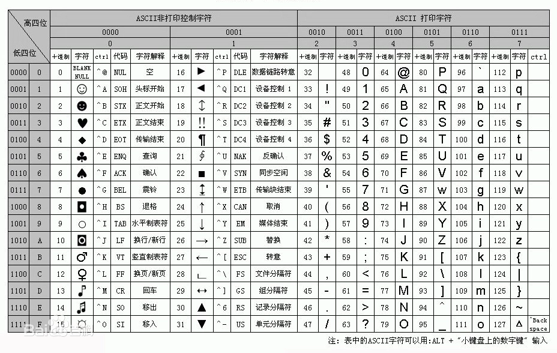

- 2.1字符集
- 2.2注释
- 2.3直接量
- 2.4标识符和保留字
- 2.5可选的分号

# 



| \u0020


## [编码问题背后的各种来龙去脉](https://zhuanlan.zhihu.com/p/113772793)

从 ASCII 码说起
现代计算机技术从英文国家兴起，最先遇到的也是英文文本。英文文本一般由 26 个字母、 10 个数字以及若干符号组成，总数也不过 100 左右。

计算机中最基本的存储单位为 字节 ( byte )，由 8 个比特位( bit )组成，也叫做 八位字节 ( octet )。8 个比特位可以表示 $ 2^8 = 256 $ 个字符，看上去用字节来存储英文字符即可？

计算机先驱们也是这么想的。他们为每个英文字符编号，再加上一些控制符，形成了我们所熟知的 ASCII 码表。实际上，由于英文字符不多，他们只用了字节的后 7 位而已。


根据 ASCII 码表，由 01000001 这 8 个比特位组成的八位字节，代表字母 A 。


顺便提一下，比特本身没有意义，比特 在 上下文 ( context )中才构成信息。举个例子，对于内存中一个字节 01000001 ，你将它看做一个整数，它就是 65 ；将它作为一个英文字符，它就是字母 A ；你看待比特的方式，就是所谓的上下文。

所以，猜猜下面这个程序输出啥？
```
#include <stdio.h>

int main(int argc, char *argv[])
{
char value = 0x41;

    // as a number, value is 65 or 0x41 in hexadecimal
    printf("%d\n", value);

    // as a ASCII character, value is alphabet A
    printf("%c\n", value);

    return 0;
}
```

latin1
西欧人民来了，他们主要使用拉丁字母语言。与英语类似，拉丁字母数量并不大，大概也就是几十个。于是，西欧人民打起 ASCII 码表那个未用的比特位( b8 )的主意。

还记得吗？ASCII 码表总共定义了 128 个字符，范围在 0~127 之间，字节最高位 b8 暂未使用。于是，西欧人民将拉丁字母和一些辅助符号(如欧元符号)定义在 128~255 之间。这就构成了 latin1 ，它是一个 8 位字符集，定义了以下字符：


