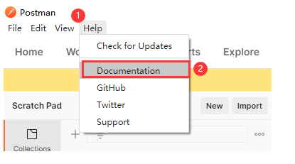

### 安装卸载更新postman

[postman官方文档](https://learning.postman.com/docs/getting-started/introduction/)
https://github.com/postmanlabs/postman-docs.git
url
解码
postman url不能用编译过的url
[url解码](http://www.jsons.cn/urlencode)

[新版Postman_9.15.2工具介绍](https://blog.csdn.net/weixin_43178040/article/details/124856955)

1、Postman介绍

官网地址：https://www.getpostman.com/
官方文档地址: https://www.getpostman.com/docs/
问题反馈官方地址：https://go.pstmn.io/app-issues
官方git地址：https://github.com/postmanlabs
官方实例学习：http://blog.getpostman.com/case-studies/
官方blog: http://blog.getpostman.com/
官方下载地址：https://www.getpostman.com/apps
版本分别有：
chrome插件版本
mac版本
linux版本(32/64)
windows客户端版本(32/64)
newman: https://www.npmjs.com/package/newman,本说明不涉及newman。
介绍：
很好用的一款API/接口功能测试工具，很方便的发送数据，查看响应，设置检查点/断言，能进行一定程度上的自动化测试，但是不要指望它能代替你进行性能测试，一次批量执行太多太久的话容易崩溃掉。
有免费版、pro版、企业版三个版本。个人学习及日常工作免费版完全够用。
本系列介绍中，如无特殊说明，均以postman chrome客户端版为例。
注:
POSTMAN里的各种语法是基于JS的，很容易上手.
————————————————
版权声明：本文为CSDN博主「张某人想退休」的原创文章，遵循CC 4.0 BY-SA版权协议，转载请附上原文出处链接及本声明。
原文链接：https://blog.csdn.net/weixin_43178040/article/details/124856955