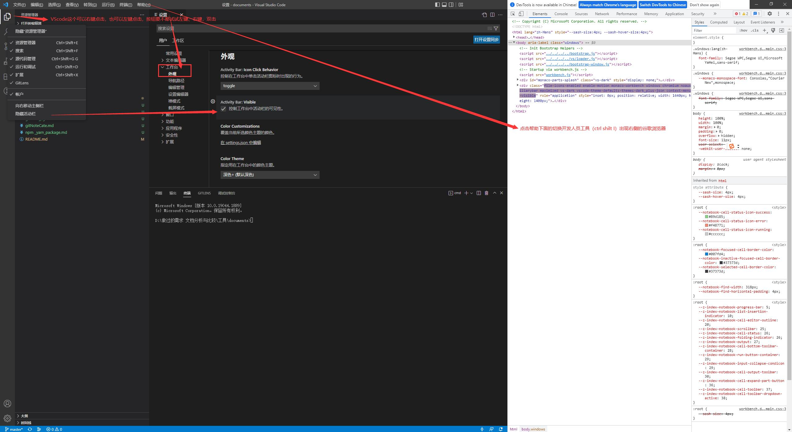
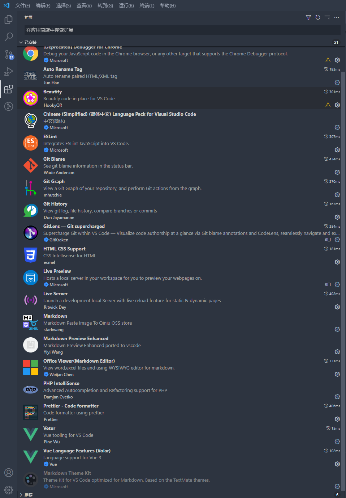

[visualstudio](https://code.visualstudio.com/)
名字来源
VisualStudio 技术运用
visual studio 可视化工作室
## 发明者：Erich Gamma
Erich Gamma 是《设计模式》一书的作者之一

# [Visual Studio Code 教程](https://www.w3cschool.cn/vscode/)
https://www.w3cschool.cn/vscode/vscode-intro.html

# [VScode专栏](https://www.kancloud.cn/shangyewangchuan/vs_code/972681)

# VScode查看word文档方法介绍

在扩展界面的[搜索框中输入“office viewer”安装。Office Viewer(Markdown Editor)

[VSCode打断点](https://blog.csdn.net/mygoes/article/details/115363628)
[visualstudio - debugging](https://code.visualstudio.com/docs/nodejs/nodejs-debugging)

## 断点：

菜单栏：运行-新建断点

## 插件安装，效率提升

vscode 写作计划
安装插件
