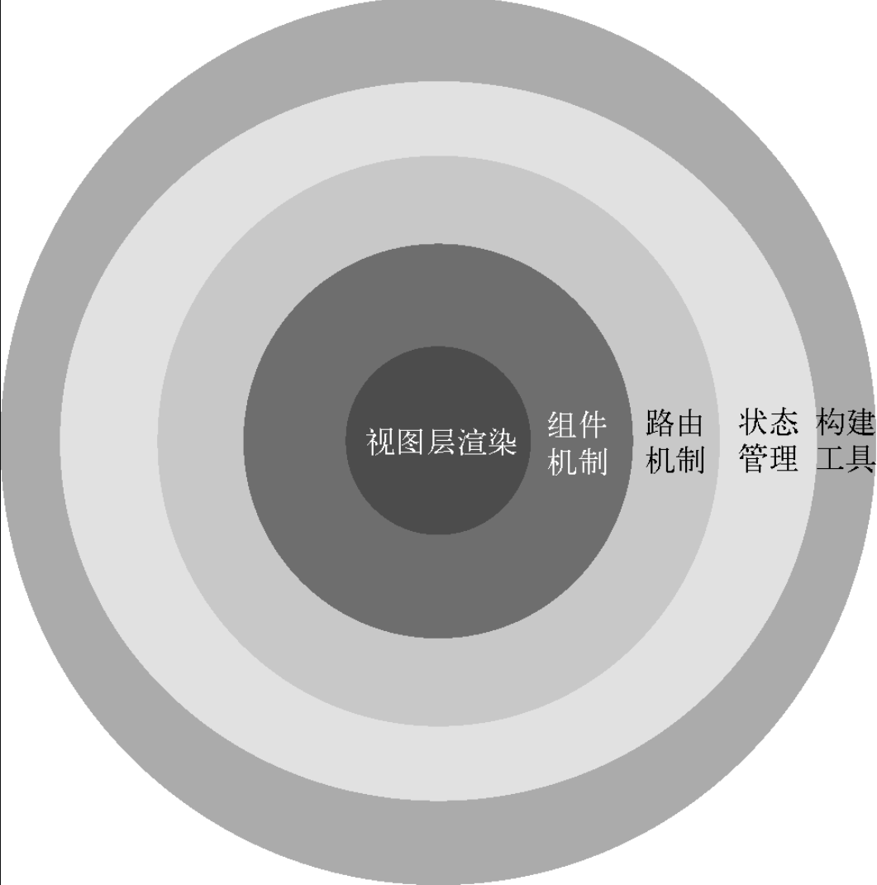

### Vue.js的定位 The Progressive Framework

`所谓渐进式框架`，就是把框架分层。
最核心的部分是视图层渲染，然后往外是组件机制，在这个基础上再加入路由机制，再加入状态管理，最外层是构建工具，如图1-1所示。

`所谓分层`，就是说你既可以只用最核心的视图层渲染功能来快速开发一些需求，
也可以使用一整套全家桶来开发大型应用。Vue.js有足够的灵活性来适应不同的需求，
所以你可以根据自己的需求选择不同的层级。

关于什么是渐进式，后来才弄懂，就是说如果你已经有一个现成的服务端应用，也就是非单页应用，
可以将Vue.js作为该应用的一部分嵌入其中，带来更加丰富的交互体验。

Vue.js 2.0引入了虚拟DOM，其渲染过程变得更快了。虚拟DOM现在已经被网上说烂了，但是我想说的是，不要人云亦云。Vue.js引入虚拟DOM是有原因的。事实上，并不是引入虚拟DOM后，渲染速度变快了。准确地说，应该是80% 的场景下变得更快了，而剩下的20% 反而变慢了。任何技术的引入都是在解决一些问题，`而通常解决一个问题的同时会引发另外一个问题`，这种情况更多的是做权衡，做取舍。所以，不要像网上大部分人那样，成天说因为引入了虚拟DOM而变快了。我们要透过现象看本质，本书的目的也在于此。