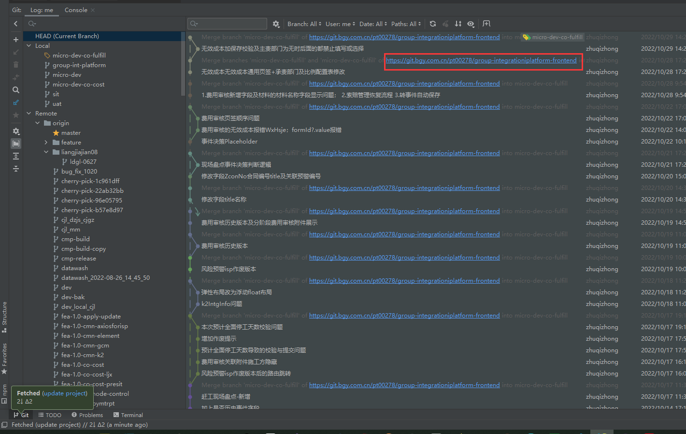

[gitmind](https://gitmind.cn/app/docs)
[https://docs.qq.com/mind/DWElSVUZSRmlRY0hY?&u=5b006e3e2e73409eb396da686500515a](https://docs.qq.com/mind/DWElSVUZSRmlRY0hY?&u=5b006e3e2e73409eb396da686500515a)

git log --pretty=format:"%ai , %an: %s" --since="16 day ago" >> ~/Desktop/commit.log
git log --pretty=format:"%ai , %an: %s" --since="10 day ago" | grep "提交者的名字" >> ~/Desktop/commit.log
git log --pretty=format:"%ai , %an: %s" --since="12 day ago" | grep "zhuqizhong" >> ~/Desktop/commit-zhuqizhong01.csv
(表格自适应内容)

1.1、在项目根目录下执行命令，导出 git 提交记录到桌面
进入项目目录：然后右击选择git bash here     然后在git中执行命令：
git log --pretty=format:"%ai , %an: %s" --since=“100 day ago” >> ~/Desktop/commit.log
1.2 、如果想导出某些提交者的提交记录，可以用 grep过滤，比如我想导出「ianly」这个人在项目中的提交记录：
git log --pretty=format:"%ai , %an: %s" --since=“126 day ago” | grep “ianly” >> ~/Desktop/commit-ianly.log
1.3、导出成 Excel 文件：
git log --date=iso --pretty=format:’"%h","%an","%ad","%s"’ >> ~/Desktop/commit.csv

git只提交部分修改的文件（提交指定文件）

git只提交部分修改的文件（提交指定文件）
1/ git status -s 查看仓库状态
2/ git add src/components/文件名 添加需要提交的文件名（加路径–参考git status 打印出来的文件路径）
3/ git stash -u -k 忽略其他文件，把现修改的隐藏起来，这样提交的时候就不会提交未被add的文件
4/ git commit -m “哪里做了修改可写入…”
5/ git pull 拉取合并
6/ git push 推送到远程仓库
7/ git stash pop 恢复之前忽略的文件（非常重要的一步）
————————————————
版权声明：本文为CSDN博主「看，未来」的原创文章，遵循CC 4.0 BY-SA版权协议，转载请附上原文出处链接及本声明。
原文链接：https://blog.csdn.net/qq_43762191/article/details/126679760

                                                                                                                                                                                                                                            

绪论

对话形式（讨论式写作），访谈式写作（问答式写作）

提示: 由于 Git 不支持空文件夾，创建文件夹后会生成空的 .keep 文件
- [w3schools-git](https://www.w3schools.com/git/git_getstarted.asp?remote=github)
- [mozilla](https://developer.mozilla.org/en-US/docs/Learn/Tools_and_testing/GitHub)
- [gitee](https://gitee.com/xiaoxiang516/)
- [github](https://github.com/elemefe)
- [Git/gitlab/github/tortoiseGit](https://blog.csdn.net/amnesiac666/category_10571446.html)

### 教程/文章书籍
- [Git官网教程](https://git-scm.com/)
- [阮一峰 Git 教程](https://www.bookstack.cn/read/git-tutorial/docs-basic.md)
- [廖雪峰 Git 教程](https://www.liaoxuefeng.com)
- [runoob Git 教程](https://www.runoob.com/git/git-tutorial.html)

<!-- >官网下的讨论值得关注 -->
- [Gitee自动同步GitHub仓库](https://cdn.modb.pro/db/488180)
- [IT全栈 华强工作室](https://blog.csdn.net/sunhuaqiang1/category_10897575.html?spm=1001.2014.3001.5482)

## Git的应用
为什么使用git，使用git能给我们带来什么
git的风险与不足
Bash GUI
笔记内容化见：Git_liaoxuefeng.md
- 使用git进行word版本管理

### 不同系统
windows
linux
Mac

git stash list

# 一体化的安装npm
如何模拟git冲突，提示冲突的原理是什么

培训的教务平台代项目代码
设管代码git命令分析
帷幄git命令分析
供应商git命令分析
一体化git命令分析
设管代码git命令分析
文件上传控件项目
一体化选人控件项目

### 开发实践事件：
团队公用一个分支开发，其中一个开发操作失误，出现代码覆盖，代码丢失

@所有人 前端代码分支管理【以下要求，将从 2022.8.30  22:00 实施并执行】
1. sit/uat/prod/dev/micro-dev 分支作为保护分支，只有 maintainer 权限可以 push&merge
2. 业财（财务、投策、营销、采购）：micro-dev-integration 分支，责任人：陈露佳@高高高高高高高  maintainer 权限
3. SRM：micro-dev-srm 分支，责任人：过彪@过彪 Bryan &关华@hua  maintainer 权限
4. 成本：micro-dev-co-cost 分支，责任人：张华@张华  maintainer 权限
5. 履约：micro-dev-co-fulfill 分支，责任人：伍健聪@Tony ⁵  maintainer 权限
6. 各组责任人可 merge 本组分支到 micro-dev，注意如果有修改了除 views 文件夹的，需要知会高铭@M
 
elementUI组件库命令分析

> 记录此项目实现过程中用到的git知识

[VScode跳到仓库地址]()
git remote -v
origin  https://***/.git (fetch)
origin  https://***/..git (push)
然后按住ctrl键，点击跳转

[VScode与git](https://code.visualstudio.com/docs/sourcecontrol/overview)

Webstorm与git
执行命令成功后的提示信息解析

[术语](term)

push commits to the origin remote

[webstorm跳转仓库地址]()

[Windows: HBuilderX Git使用教程](https://ask.dcloud.net.cn/article/35247)

Development Tools
Eclipse
IDE
Visual Studio
短语
1.
开发工具 Development ToolsEclipseIDEVisual Studio
2.
软件开发工具包 software development kitSDKQt SDKAndroid SDK
3.
开发工具包 JDKSDKQt SDK
