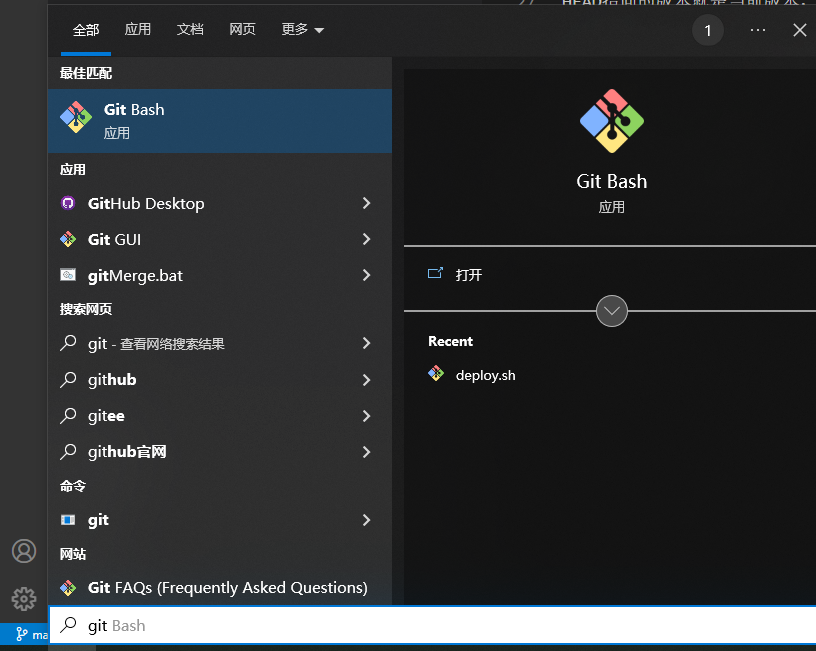

## 安装Git
在Windows上使用Git，可以从Git官网直接下载安装程序，然后按默认选项安装即可。

安装完成后，在开始菜单里找到“Git”->“Git Bash”，蹦出一个类似命令行窗口的东西，就说明Git安装成功！

根目录


### 【git】——使用git对word文件进行管理


### 使用git进行word版本管理

Your branch is `ahead of` 'origin/master' by 1 commit.
(use "git push" to publish your local commits)

`ahead of` 英 [əˈhed əv]  美 [əˈhed əv] prep. 在……之前；早于；领先


### 【git】——使用git对word文件进行管理


### 版本回退
```
小结
现在总结一下：

HEAD指向的版本就是当前版本，因此，Git允许我们在版本的历史之间穿梭，使用命令git reset --hard commit_id。

穿梭前，用git log可以查看提交历史，以便确定要回退到哪个版本。

要重返未来，用git reflog查看命令历史，以便确定要回到未来的哪个版本。
```
### 工作区、暂存区、版本库（Repository）【本地仓库、远程仓库】
工作区（Working Directory）: 在电脑里能看到的目录(有一个隐藏目录.git)
暂存区:称为stage（或者叫index）
版本库（Repository）:


```
https://www.liaoxuefeng.com/wiki/896043488029600/897271968352576
感觉大家把简单问题复杂化了，看着头晕，

Git管理的文件分为：工作区，版本库，版本库又分为暂存区stage和暂存区分支master(仓库)

工作区>>>>暂存区>>>>仓库

git add把文件从工作区>>>>暂存区，git commit把文件从暂存区>>>>仓库，

git diff查看工作区和暂存区差异，

git diff --cached查看暂存区和仓库差异，

git diff HEAD 查看工作区和仓库的差异，

git add的反向命令git checkout，撤销工作区修改，即把暂存区最新版本转移到工作区，

git commit的反向命令git reset HEAD，就是把仓库最新版本转移到暂存区。

不知道我分析的对不对。
```


```

```
### 管理修改
https://www.liaoxuefeng.com/wiki/896043488029600/897884457270432
```
小结
现在，你又理解了Git是如何跟踪修改的，每次修改，如果不用git add到暂存区，那就不会加入到commit中。
```

### 撤销修改
```

```

### 删除文件
```

```


### 添加远程库
```
小结
要关联一个远程库，使用命令git remote add origin git@server-name:path/repo-name.git；

关联一个远程库时必须给远程库指定一个名字，origin是默认习惯命名；

关联后，使用命令git push -u origin master第一次推送master分支的所有内容；

此后，每次本地提交后，只要有必要，就可以使用命令git push origin master推送最新修改；

分布式版本系统的最大好处之一是在本地工作完全不需要考虑远程库的存在，也就是有没有联网都可以正常工作，而SVN在没有联网的时候是拒绝干活的！当有网络的时候，再把本地提交推送一下就完成了同步，真是太方便了！
```

### 从远程库克隆

```
小结
要克隆一个仓库，首先必须知道仓库的地址，然后使用git clone命令克隆。

Git支持多种协议，包括https，但ssh协议速度最快。
```

### 分支管理

```

```

### 
```

```


### 
```

```

### 只commit或push指定的几个文件

```
git 只提交指定文件，如果此时修改了其他的代码。可先提交指定代码，然后忽略不想提交的代码，最后push之后，恢复之前忽略的代码。

关键步骤：2、6

git add src/xxxxxxxx 添加需要提交的文件名（加路径–参考git status打印出来的路径）
git stash -u -k 忽略其他文件，把现修改的隐藏起来，这样提交的时候就不会提交未被add的文件；
git commit -m ‘fix：xxxxxxxx’；
git pull 拉去合并
git push 推送到远程仓库
git stash pop 恢复之前忽略的文件
————————————————
版权声明：本文为CSDN博主「小海豚~游啊游啊游~」的原创文章，遵循CC 4.0 BY-SA版权协议，转载请附上原文出处链接及本声明。
原文链接：https://blog.csdn.net/haibo1101/article/details/125517638
```