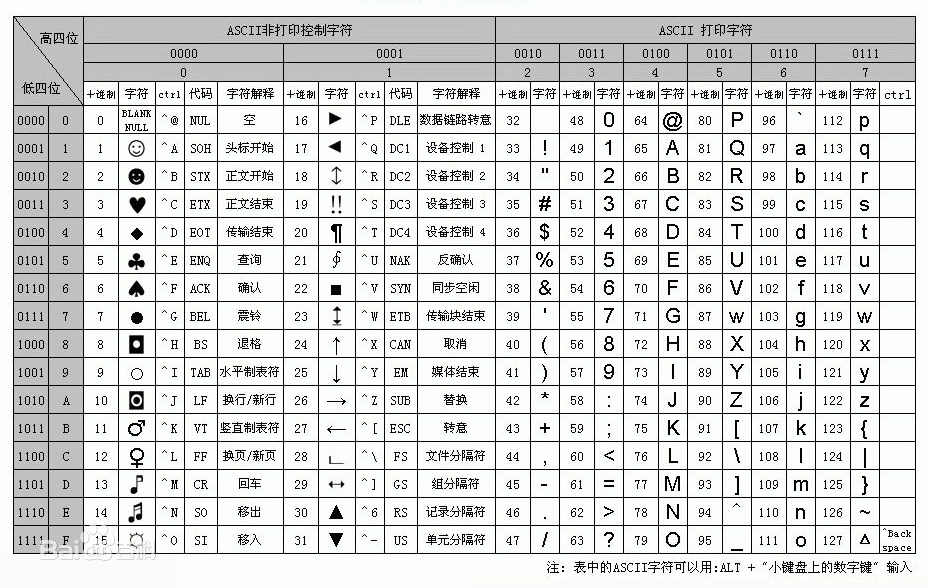

## 常用


## Ecosystem

| Project             | Status    | Description   |
| ------------------- | --------- | ------------- |
| [Vue-router]        | [![vue-router-status]][vue-router-package]| aa |

[vue-router]: https://github.com/vuejs/vue-router

## Documentation
`潇湘`：字体颜色设置（不给具体链接）
To check out [live examples]() and docs, visit [vuejs.org]()


## **md文件在vscode中预览**

## md中引入图片
> 剪贴板截图粘贴自动生成图片目录

1. 在sublime中写markdowm，引入图片写法如下
   参考样式：
   
2.如果想改变图片大小，写法按如下不支持
    参考样式：

3.可以通过如下方式解决
   


<!--
重要: 请使用以下链接创建新 issue

  https://elementui.github.io/issue-generator

未通过以上链接创建的 issue 会被机器人直接关闭。

########

IMPORTANT: Please use the following link to create a new issue:

  https://elementui.github.io/issue-generator

If your issue was not created using the app above, it will be closed immediately.
-->
# Guía para Contribuidores a `Element UI`


Please make sure these boxes are checked before submitting your PR, thank you!

* [ ] Make sure you follow Element's contributing guide ([中文](https://github.com/ElemeFE/element/blob/master/.github/CONTRIBUTING.zh-CN.md) | [English](https://github.com/ElemeFE/element/blob/master/.github/CONTRIBUTING.en-US.md) | [Español](https://github.com/ElemeFE/element/blob/master/.github/CONTRIBUTING.es.md) | [Français](https://github.com/ElemeFE/element/blob/master/.github/CONTRIBUTING.fr-FR.md)).
* [ ] Make sure you are merging your commits to `dev` branch.
* [ ] Add some descriptions and refer relative issues for you PR.

## Pré-requis
`Node.js 4+`, `yarn` et `npm 3+` sont requis. Note: nous utilisons yarn pour verrouiller les versions des dépendances, donc vous devriez installer les dépendances en utilisant `yarn` au lieu de `npm install`.
```shell
git clone git@github.com:ElemeFE/element.git
npm run dev

# open http://localhost:8085
```

> **Remarque** : modifiez le fichier `examples/play/index.vue`, utilisez le composant auquel vous contribuez, puis lancez `npm run dev:play`, allez sur [http://localhost:8085](http://localhost:8085), regardez le résultat rapidement et facilement.


1. 键盘#
<kbd>Backspace</kbd>

2. 路径#
   /usr/local/nginx/sbin/nginx

<span style="color:#4185c4;">/usr/local/nginx/sbin/nginx</span>

3. 彩色字体背景#
   Nginx is not running !

<b style="color:red;">Nginx&nbsp;is&nbsp;not&nbsp;running&nbsp;!</b>
Nginx is running !

<b style="color:green;">Nginx&nbsp;is&nbsp;running&nbsp;!</b>
Nginx is running !

<b style="background-color:green;color:white;"> Nginx is running ! </b>
4. 折叠#
展开查看内容
<details>
 <summary>展开查看内容</summary>
 这是展开后的内容。
</details>


<table align="center">
    <tr>
        <th rowspan="2">真实情况</th>
        <th colspan="2">预测结果</th>
    </tr>
    <tr>
        <td>正例</td>
        <td>反例</td>
    </tr>
    <tr>
        <td>正例</td>
        <td>TP(真正例)</td>
        <td>FN(假反例)</td>
    </tr>
    <tr>
        <td>反例</td>
        <td>FP(假正例)</td>
        <td>TN(真反例)</td>
    </tr>
</table>


### Font-family 代码

```css
font-family: "Helvetica Neue", Helvetica, "PingFang SC", "Hiragino Sans GB",
  "Microsoft YaHei", "微软雅黑", Arial, sans-serif;
```

分割线---

---

## Introduction

Vue (pronounced `/vju:/`, like view) is a **progressive framework** for building user interfaces. 


#### Browser Compatibility

Vue.js supports all browers that are [ES5-compliant]()(IE8 and blow are not supported).

## 文档参考链接


## 目录
1. [前言](#README)
1. [ECMAScript 6简介](#docs/intro)
1. [let和const命令](#docs/let)
1. [变量的解构赋值](#docs/destructuring)
1. [字符串的扩展](#docs/string)
1. [正则的扩展](#docs/regex)
1. [数值的扩展](#docs/number)

## 其他
- [源码](http://github.com/ruanyf/es6tutorial/)
- [修订历史](https://github.com/ruanyf/es6tutorial/commits/gh-pages)
- [反馈意见](https://github.com/ruanyf/es6tutorial/issues)

二进制数组由三类对象组成。

**（1）ArrayBuffer对象**：代表内存之中的一段二进制数据，可以通过“视图”进行操作。“视图”部署了数组接口，这意味着，可以用数组的方法操作内存。

**（2) TypedArray视图**：共包括9种类型的视图，比如Uint8Array（无符号8位整数）数组视图, Int16Array（16位整数）数组视图, Float32Array（32位浮点数）数组视图等等。

**（3）DataView视图**：可以自定义复合格式的视图，比如第一个字节是Uint8（无符号8位整数）、第二、三个字节是Int16（16位整数）、第四个字节开始是Float32（32位浮点数）等等，此外还可以自定义字节序。


数据类型 | 字节长度 | 含义 | 对应的C语言类型
--------|--------|----|---------------
Int8|1|8位带符号整数|signed char
Uint8|1|8位不带符号整数|unsigned char
Uint8C|1|8位不带符号整数（自动过滤溢出）|unsigned char
Int16|2|16位带符号整数|short
Uint16|2|16位不带符号整数|unsigned short
Int32|4|32位带符号整数|int
Uint32|4|32位不带符号的整数|unsigned int
Float32|4|32位浮点数|float
Float64|8|64位浮点数|double