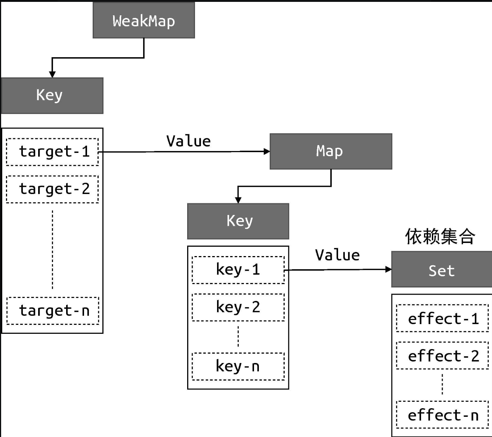

作者
文章脉络
文章结构

## 4.3　设计一个完善的响应系统

解决硬副作用函数名字编码问题（effect）
```javascript
 // 用一个全局变量存储被注册的副作用函数
 let activeEffect
 // effect 函数用于注册副作用函数
 function effect(fn) {
   // 当调用 effect 注册副作用函数时，将副作用函数 fn 赋值给 activeEffect
   activeEffect = fn
   // 执行副作用函数
   fn()
 }
 

 //  使用 effect 函数
 effect(
  // 一个匿名的副作用函数
  () => {
    document.body.innerText = obj.text
  }
)


 const obj = new Proxy(data, {
   get(target, key) {
     // 将 activeEffect 中存储的副作用函数收集到“桶”中
     if (activeEffect) {  // 新增
       bucket.add(activeEffect)  // 新增
     }  // 新增
     return target[key]
   },
   set(target, key, newVal) {
     target[key] = newVal
     bucket.forEach(fn => fn())
     return true
   }
 })

// 可以看到，我们使用一个匿名的副作用函数作为 effect 函数的参数。
// 当 effect 函数执行时，首先会把匿名的副作用函数 fn 赋值给全局变量 activeEffect。
// 接着执行被注册的匿名副作用函数 fn，这将会触发响应式数据 obj.text 的读取操作，进而触发代理对象 Proxy 的 get 拦截函数：
```


 #### 在响应式数据 obj 上设置一个不存在的属性与重新设计“桶”的数据结构

```javascript
 effect(
   // 匿名副作用函数
   () => {
     console.log('effect run') // 会打印 2 次
     document.body.innerText = obj.text
   }
 )

 setTimeout(() => {
   // 副作用函数中并没有读取 notExist 属性的值
   obj.notExist = 'hello vue3'
 }, 1000)
```

在副作用函数与被操作的字段之间建立联系
```javaScript
01 // 存储副作用函数的桶
02 const bucket = new WeakMap()
```

#### 数据结构设计

```javaScript
// 树型结构（建立原理）: 表示副作用函数读取一个对象的属性值

// 副作用函数读取同一个对象的属性值
 effect(function effectFn() {
   document.body.innerText = obj.text
 })

// target 来表示一个代理对象所代理的原始对象
01 target
02     └── key
03         └── effectFn


// 两个副作用函数同时读取同一个对象的属性值
 effect(function effectFn1() {
   obj.text
 })
 effect(function effectFn2() {
   obj.text
 })

01 target
02     └── text
03         └── effectFn1
04         └── effectFn2


// 一个副作用函数中读取了同一个对象的两个不同属性
 effect(function effectFn() {
   obj.text1
   obj.text2
 })

01 target
02     └── text1
03         └── effectFn
04     └── text2
05         └── effectFn


// 如果在不同的副作用函数中读取了两个不同对象的不同属性
 effect(function effectFn1() {
   obj1.text1
 })
 effect(function effectFn2() {
   obj2.text2
 })

01 target1
02     └── text1
03         └── effectFn1
04 target2
05     └── text2
06         └── effectFn2
```

### WeakMap、Map 和 Set 之间的关系

#### WeakMap 和 Map 的区别
```javaScript
 const map = new Map();
 const weakmap = new WeakMap();

 (function(){
     const foo = {foo: 1};
     const bar = {bar: 2};

     map.set(foo, 1);
     weakmap.set(bar, 2);
 })()

//  首先，我们定义了 map 和 weakmap 常量，分别对应 Map 和 WeakMap 的实例。接着定义了一个立即执行的函数表达式（IIFE），在函数表
//  达式内部定义了两个对象：foo 和 bar，这两个对象分别作为 map 和 weakmap 的 key。当该函数表达式执行完毕后，对于对象 foo 来说，
//  它仍然作为 map 的 key 被引用着，因此垃圾回收器（grabage collector）不会把它从内存中移除，我们仍然可以通过map.keys 打印出对
//  象 foo。然而对于对象 bar 来说，由于 WeakMap 的 key 是弱引用，它不影响垃圾回收器的工作，所以一旦表达式执行完毕，垃圾回收器就
//  会把对象 bar 从内存中移除，并且我们无法获取 weakmap 的 key 值，也就无法通过 weakmap 取得对象 bar。
```
简单地说，WeakMap 对 key 是弱引用，不影响垃圾回收器的工作。据这个特性可知，一旦 key 被垃圾回收器回收，
那么对应的键和值就访问不到了。所以WeakMap 经常用于存储那些只有当 key 所引用的对象存在时（没有被回收）才
有价值的信息，例如上面的场景中，如果 target 对象没有任何引用了，说明用户侧不再需要它了，这时垃圾回收器会
完成回收任务。但如果使用 Map 来代替WeakMap，那么即使用户侧的代码对 target 没有任何引用，这个 target 也
不会被回收，最终可能导致内存溢出。


### 上文中的代码做一些封装处理

```javaScript
 const obj = new Proxy(data, {
   // 拦截读取操作
   get(target, key) {
     // 将副作用函数 activeEffect 添加到存储副作用函数的桶中
     track(target, key)
     // 返回属性值
     return target[key]
   },
   // 拦截设置操作
   set(target, key, newVal) {
     // 设置属性值
     target[key] = newVal
     // 把副作用函数从桶里取出并执行
     trigger(target, key)
   }
 })

 // 在 get 拦截函数内调用 track 函数追踪变化
 function track(target, key) {
   // 没有 activeEffect，直接 return
   if (!activeEffect) return
   let depsMap = bucket.get(target)
   if (!depsMap) {
     bucket.set(target, (depsMap = new Map()))
   }
   let deps = depsMap.get(key)
   if (!deps) {
     depsMap.set(key, (deps = new Set()))
   }
   deps.add(activeEffect)
 }
 // 在 set 拦截函数内调用 trigger 函数触发变化
 function trigger(target, key) {
   const depsMap = bucket.get(target)
   if (!depsMap) return
   const effects = depsMap.get(key)
   effects && effects.forEach(fn => fn())
 }
```


