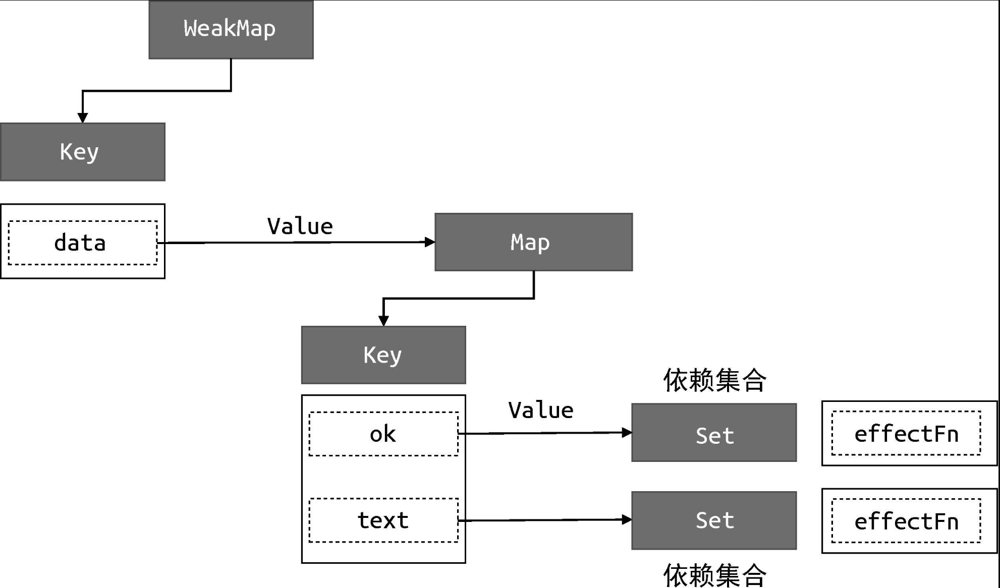

解决问题：effectFn 函数内部存在分支切换导致遗留的副作用函数会导致不必要的更新
目标：修改副作用函数 effectFn 与响应式数据之间的联系
### 分支切换
```javaScript
 const data = { ok: true, text: 'hello world' }
 const obj = new Proxy(data, { /* ... */ })

 effect(function effectFn() {
   // 分支切换:三元表达式的值不同，代码执行的分支会跟着变化
   document.body.innerText = obj.ok ? obj.text : 'not'
 })

// 图4-4　副作用函数与响应式数据之间的联系
01 data
02     └── ok
03         └── effectFn
04     └── text
05         └── effectFn

// 图4-5　理想情况下副作用函数与响应式数据之间的联系
01 data
02     └── ok
03         └── effectFn
// 问题产生：
// 当我们把字段 obj.ok 的值修改为 false，并触发副作用函数重新执行之后，整个依赖关系仍然保持图 4-4 所描述的那样，
// 这时就产生了遗留的副作用函数。
```


遗留的副作用函数会导致不必要的更新

### 副作用函数从依赖集合中移除
图4-6　断开副作用函数与响应式数据之间的联系