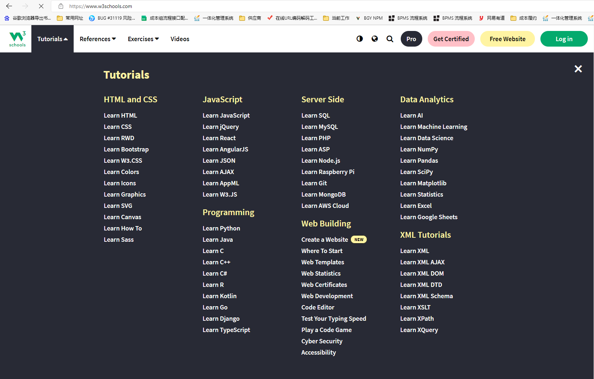

### 首页

书本的封面页制作

目录设计
注释设计
篇章设计

补充工作中遇到的业务、产品、前端、后端、测试、运维的内容，拥有管理者的思想

### 搜索平台

Front-end JS framework
前端JS框架有: vue.js、react.js、Angular.js、Bootstrap、Jquery、Zepto等；
前端UI框架有：QUICK UI、iviewUI、Layui、elementUI、Mint UI、WeUI、MUI等等。

---

<!-- - [{:height="100px" width="400px"}](https://www.zhihu.com/)
-  -->
 
  

- 
- [CSDN](https://www.csdn.net/)
- [juejin](https://juejin.cn/)
- [segmentfault](https://segmentfault.com/)
- [infoq](https://www.infoq.cn/)

- [geeksforgeeks](https://www.geeksforgeeks.org/html/)
- [blog.51cto](https://blog.51cto.com/u_15490526/5291263)
- [geekbang](https://s.geekbang.org/)
---

### 搜书
[小白盘](https://www.xiaobaipan.com/)
[微信读书](https://developers.weixin.qq.com/miniprogram/dev/framework/)
[月萌网](https://www.moonapi.com/news/books/id/172.html)
https://www.moonapi.com/news/33492.html
[百度云-百度网盘]

[geekdaxue](http://geekdaxue.co/)
