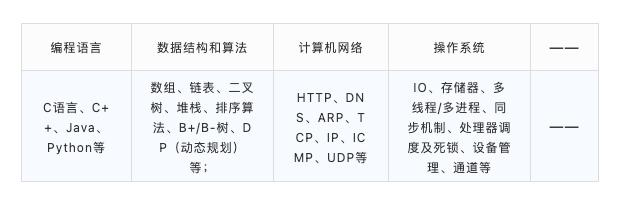

[web前端面试 - 面试官系列](https://vue3js.cn/interview/)

若川知乎问答：2年前端经验，做的项目没什么技术含量，怎么办？

前端面试
 [若川 面试官问系列 ](https://www.lxchuan12.cn/js-extend/)
[前端面试常考问题整理，按模块知识点分类：](https://blog.poetries.top/FE-Interview-Questions/)
[前端开发面试题:](https://github.com/markyun/My-blog/tree/master/Front-end-Developer-Questions)
[web前端面试宝典：](https://github.com/h5bp/Front-end-Developer-Interview-Questions/)
[掘金前端面试题合集：](https://github.com/shfshanyue/blog/blob/master/post/juejin-interview.md)
[前端面试图谱：](https://yuchengkai.cn/docs/zh/)
[GitHub 上 100K+ Star 的前端面试开源项目汇总](https://github.com/biaochenxuying/blog/issues/47)

 [谁在招人？ 阮一峰](https://github.com/ruanyf/weekly/issues/1747)
 [牛客网](https://www.nowcoder.com/interview/ai/cover?jobTagId=644)
 [力扣](https://leetcode.cn/)

计算机基础知识体系
`
前言
写作不容易。阮一峰在其博客中引入一句话到：“作为一名工程师，最被低估的技能是记录。说真的，如果有人可以教我怎么写文档，我会付钱，也许是 1000 美元。”
`
个人网站的搭建何时才能提上日程

国内知名前端大佬汇总，阮一峰，廖雪峰，张鑫旭，勾三股四，贺师俊，周爱民，徐涛，徐飞，大漠，CSS魔法，小芋头君，林建锋等等。

张鑫旭

[技术写作指南](https://juejin.cn/book/7184663814950879270/section/7184824069563351043?suid=4089838985290910&source=android)
作者文字激扬，感情慷慨，逸于奔放。文字中透露出坚持写作改变了他的命运，还有坚持研究。**付费搭建个人博客**，并在上面更新自己的技术研究心得。
而这个博客就成了非常好的自我展示的舞台.
- 今昔对比：
叙述其工作之前的往事及工作之后取得的一些成果：如7岁父母离异随母亲，母亲无业；小学初中高中学费都是全免；高一时其母因意外溺水去世。
家庭贫困，毕业失业，借债上班
总述技术写作给他的命运带来的改变：
HR 筛选简历看什么呢？
一是学历，二是履历，三是绩效，用通俗的话解释就是 985，BAT，高晋升。
内推：

- 突破瓶颈与坚持（研究并取得一些成果）
起初的想法也很单纯，就展示自己的研究成果和作品，分享自己学到的新技术，这也是很多人技术写作的初衷，也就是常说的“用爱发电”。
但是，纯粹的用爱发电是很难坚持的，**和我同时代的那么多技术博客，如今还活着的寥寥无几。**

所谓的成功，其实就是比同龄人更加优秀，从而有更大的概率获得更多的资源，所以要做的事情就很简单，把自己擅长的做到极致，把自己的不足提高到至少平均水平。
技术写作相当于一种强迫的手段，让我不断涉猎我这个技术领域的广度知识和深度知识，在不断地创作中查漏补缺，提炼思想，不断升华，持续进步。

**搭建自我展示的平台**
韩愈的自荐/自我推销/
因为写作这件事情，并不需要你短时间爆发输出，你可以慢慢整理，慢慢输出，只要用心就可以做到。
这就要感谢我毕业后做的一个决定，**付费搭建个人博客**，并在上面更新自己的技术研究心得。
而这个博客就成了非常好的自我展示的舞台，

### [玉伯](https://www.yuque.com/yubo/morning/three-periods-of-knowledge-management)

我的前端成长之路 玉伯

一是想把前辈们写的不太好的代码改得更好，二是发现业务很有趣，可以通过代码对整个淘宝交易流程很熟悉。
记得癫总有时还跑过来问我一些业务细节，真正的细节魔鬼都掌握在写代码的人手中。现在的交易流程中，在退款等页面，
前几年看还有部分代码是我写的。当时对整个淘宝交易流程超级熟悉，很有骄傲感。可能正是因为这种疯狂，2009 年从 P6 跨级提名 P8，没
经过面试就通过了晋升。
人唯一的财富就是自己的时间，要对自己的时间负责

决定一个产品灵魂的，往往不是选择做什么，而是选择不做什么。

大部分企业校招都会着重考察同学的专业知识，包括编程语言基础、数据结构和算法知识、计算机网络、操作系统等。尤其是算法与专业方向相关的知识面试官一定会问得比较仔细，如果知识体系完善且都掌握得不错，那么就有可能幸运的进入下一轮了。

这部分可以结合论坛上同学分享的面经进行学习，提升基础的同时，着重突破算法重难点，通过刷题不断积累和巩固。

▍实践经历

虽然很多HR说对于校招同学不对实践经历做特别要求，但是如果简历上没有一段竞赛/实习经历加持，在岗位竞争中很难占到绝对优势。

在ACM、挑战杯、数学建模等权威赛事中获得国家级金奖/一等奖，积累有工作相关的项目实习经历，都是面试的加分项。如果在校园中学有余力，一定要多参加竞赛和实践，不愿意打团体赛，也可以多参加蓝桥杯等个人赛拿奖哦！

跟着web前端大佬学技术-国内知名前端大佬汇总

浅梦
不用再去找各种学习内容，看看大佬都是如何学习提升的。
尤雨溪(尤小右)- vue项目作者
相关采访:https://www.jianshu.com/p/3092b382ee80
微博：https://weibo.com/arttechdesign?is_hot=1
知乎：https://www.zhihu.com/people/evanyou
Github：https://github.com/yyx990803、
玉伯(玉伯也叫黑侠/王保平)-淘宝前端类库 KISSY、前端模块化开发框架SeaJS、前端基础类库Arale的创始人
相关采访:https://blog.csdn.net/zz_jesse/article/details/103143737
微博：https://www.weibo.com/lifesinger?is_all=1
知乎：https://www.zhihu.com/people/lifesinger
Github：https://github.com/lifesinger/blog/issues?q=label:blog

阮一峰-知名博主，就职于支付宝的前端团队体验技术部
个人网站：http://www.ruanyifeng.com/home.html
阮一峰es6入门教程：https://es6.ruanyifeng.com/
微博：https://weibo.com/ruanyf?is_all=1
Github：https://github.com/ruanyf

司徒正美(钟钦成) 著名的Java专家，去哪儿网前端架构师
个人网站：https://www.cnblogs.com/rubylouvre/
微博：https://weibo.com/jslouvre?is_all=1
Github：https://github.com/RubyLouvre

朴灵(JacksonTian\田永强) 资深工程师，就职于阿里巴巴数据平台，Node.js布道者，写了多篇文章介绍Node.js 的细节，著有《深入浅出Node.js》
微博：https://weibo.com/shyvo?is_hot=1
知乎：https://www.zhihu.com/people/po-ling
Github：https://github.com/JacksonTian

winter(程劭非) 阿里巴巴高级技术专家，著名JavaScript专家。曾参与Bambook开发，更早为微软工作，开发 Windows CE平台的IE浏览器。
微博：https://weibo.com/wintercn?is_hot=1
知乎：https://www.zhihu.com/people/winter-25/asks
博客：https://www.cnblogs.com/winter-cn/
Github：https://github.com/wintercn

廖雪峰 知名博主，著有号称史上最浅显易懂的Git教程，口碑不错的《JS教程》
个人网站：https://www.liaoxuefeng.com/
微博：https://weibo.com/liaoxuefeng?is_all=1
知乎：https://www.zhihu.com/people/liaoxuefeng
博客：https://www.cnblogs.com/winter-cn/
Github：https://github.com/michaelliao

张鑫旭 原腾讯社交用户体验部上海设计中心UI开发，现就职阅文集团，资深钓鱼爱好者，专注web前端偏前领 域，博客笔风幽默、深刻易懂。
个人网站：https://www.zhangxinxu.com/
微博：https://weibo.com/zhangxinxu?is_all=1
知乎：https://www.zhihu.com/people/iamzhangxinxu
Github：https://github.com/zhangxinxu

勾三股四 阿里巴巴高级前端工程师，前北京傲游前端开发部经理
个人网站：https://jiongks.name/
微博：https://weibo.com/mx006?is_all=1
Github：https://github.com/jinjiang/
(此人的网址观感极差，不知是何审美)

月影(吴亮) 奇虎360高级技术经理，360前端团队奇舞团负责人
微博：https://weibo.com/silverna?is_all=1
知乎：https://www.zhihu.com/people/yue-ying-2-61
Github：https://github.com/akira-cn

贺师俊 百姓网前端技术专家。有年头的 Web 开发者，信仰 Web 标准，HTML 纯化论者 +CSS 理想主义者 +JavaScript改革派 +REST信徒
微博：https://weibo.com/haxy?is_all=1
知乎：https://www.zhihu.com/people/he-shi-jun
Github：https://github.com/hax

周爱民 现为Ruff架构师。著有《JAVASCRIPT语言精髓与编程实践》、《大道至简——软件工程实践者的思想》等
个人网站：https://aimingoo.github.io/
微博：https://weibo.com/aimingoo?is_all=1
知乎：https://www.zhihu.com/people/aimingoo
Github：https://github.com/aimingoo

徐涛 翻译了《Java Script编程精解》、《Javascript启示录》、《编写可测试的JavaScript代码》、《Backbone.js应 用程序开发》、《JavaScript忍者秘籍》、《JavaScript设计模式》等多本JavaScript方面的著作
个人网站：https://www.cnblogs.com/TomXu/
微博：https://weibo.com/tomxutao?is_all=1

徐飞(民工精髓) 苏宁云商前端架构师，国内知名前端，博客里的Angular教程很多
博客：https://github.com/xufei/blog
微博：https://weibo.com/sharpmaster?is_all=1
Github：https://github.com/xufei

大漠 W3CPlus创始人，目前就职于淘宝。出版《图解CSS3：核心技术与案例实战》
个人网站：https://www.w3cplus.com/
Github：https://github.com/airen
微博：https://weibo.com/damoqiongqiu?is_all=1
一丝 阿里巴巴集团 · 前端工程师
微博：https://weibo.com/jieorlin?is_all=1
知乎：https://www.zhihu.com/people/ysbl
Github：https://github.com/yisibl
CSS魔法 百姓网前端架构师，《CSS 揭秘》译者
个人网站：http://www.cssmagic.net/
微博：https://weibo.com/cssmagic?is_all=1
知乎：https://www.zhihu.com/people/cssmagic
Github：https://github.com/cssmagic

小芋头君 大搜车前端负责人，颜文字app作者，前端乱炖创始人
个人网站：http://www.html-js.com/
知乎：https://www.zhihu.com/people/li-shou-xin
林建锋(sofish) 前支付宝前端开发部 CSS 样式库负责人。Trimidea 创始人，目前就职饿了么
个人网站：https://sofi.sh/

微博：https://weibo.com/sofish?is_all=1
知乎：https://www.zhihu.com/people/sofish
Github：https://github.com/sofish

颜海镜 知名博主，目前就职于百度
微博：https://weibo.com/yanhaijing1234?is_all=1
知乎：https://www.zhihu.com/people/yanhaijing
Github：https://github.com/yanhaijing/
